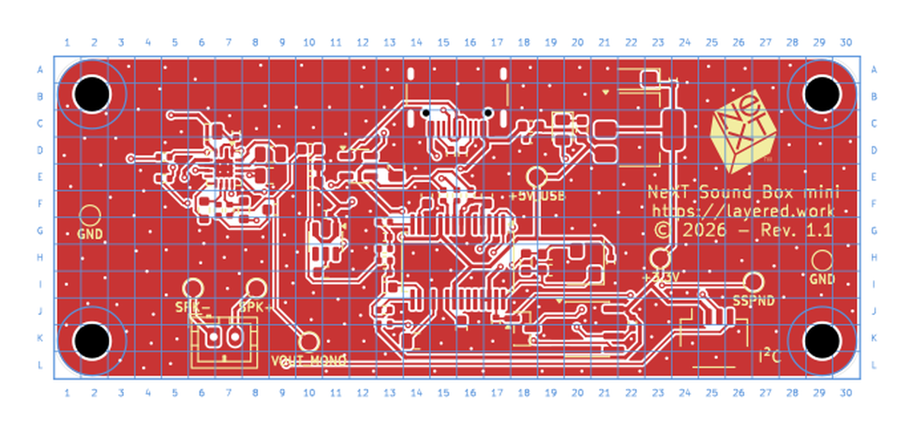

# GridRef

Draws a lettered and numbered grid around the board, the way a street map does. Instead of reading a millimetre coordinate off the cursor and hunting for it, a position has a name: the unconnected copper island is on **E9**, the regulator is on **C22**.

Columns carry numbers and run left to right, rows carry letters and run top to bottom. Rows continue past Z as AA, AB and so on, so a tall board keeps working.

The grid is drawn on a user layer, so it never reaches the fabricator. Everything it draws goes into a KiCad group named `GridRef`, which buys two things: the **Remove** button deletes exactly those objects and nothing else on that layer, and drawing a second time replaces the first grid rather than stacking another one on top. You can try three cell sizes in a row without tidying up in between.

## Settings

| Setting | Default | What it does |
|---|---|---|
| Cell size | 2.5 mm | Decides how many columns and rows the board gets |
| Layer | `Cmts.User` | Any of eight user layers, none of which is fabricated |
| Text height | 0.6 mm | Size of the letters and numbers |
| Text stroke | 0.08 mm | Line thickness of the labels |
| Grid stroke | 0.10 mm | Line thickness of the grid itself |
| Frame stroke | 0.15 mm | Line thickness around the board outline |
| Label distance | 1.3 mm | How far the labels sit outside the board |
| Draw grid lines | on | Off leaves only the frame and the labels |
| Labels on | all four sides | Top, bottom, left and right, each on its own |

Settings are written to `~/.config/kicad-plugins/gridref.json`, so they carry over to the next project.

## Colour

The colour comes from the layer, not from the objects, because a KiCad board file has no colour field on a line or a piece of text. Set it in the PCB editor's Appearance panel on the right, by double-clicking the colour swatch next to the layer. Picking a different layer in the dialog is therefore also a way of picking a different colour, since each user layer carries its own.

## Installation

See the [repository README](../README.md).

## License

This repository has been published under the [MIT](https://layered.mit-license.org) license.
